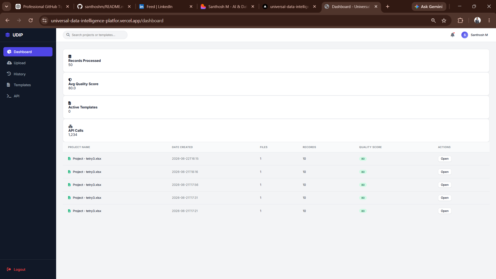

# Universal Data Intelligence Platform (UDIP)

UDIP is an Enterprise AI-Powered Data Catalog and Natural Language Query Engine built with FastAPI, Pandas, and Vanilla JavaScript. It processes multiple raw Excel files, applies AI-driven schema normalizations, performs entity resolution, and serves the resulting intelligence through an interactive dashboard.

  

⭐ If you like this project, please consider giving it a Star ⭐

## 🔗 Links

🌐 Live Demo: https://universal-data-intelligence-platfor.vercel.app

📂 GitHub Repository: https://github.com/m04-santhosh/Universal-data-intelligence-platform-UDIP

---

## ✨ Key Features

- Multi-File Excel Processing
- AI Schema Discovery
- Entity Resolution
- Data Catalog Generation
- Natural Language Query Engine
- Dashboard Analytics
- PDF & JSON Export
- Intelligent Business Insights

---

## 🛠️ Tech Stack

### Backend
- Python
- FastAPI
- Pandas

### Frontend
- HTML
- CSS
- JavaScript

### Database
- SQLite

### Deployment
- Vercel

---

## 📸 Screenshots

### Dashboard

### AI Chat Bot

### Analyzed Template

### Data Details

### History Page

### Login Page

### Sign In Page

### Template Page

### Upload Page

UDIP is an Enterprise AI-Powered Data Catalog and Natural Language Query Engine built with FastAPI, Pandas, and Vanilla JavaScript...
## Enterprise Architecture Summary

UDIP is entirely local and operates without external dependencies like a traditional database or third-party LLMs.

1. **Schema Discovery**: Replaces hardcoded column maps with a semantic inference engine (`AISchemaDiscoveryEngine`) using string similarity and heuristics to standardize raw column headers.
2. **Entity Resolution**: Groups related records intelligently (by customer ID, phone, or name) and detects conflicts.
3. **Data Catalog Generation**: Dynamically profiles the resolved dataset to calculate column types, sample values, uniqueness, and null percentages.
4. **Insights & Recommendations**: Automatically analyzes the payload to extract business insights (e.g., "Most common city: Bangalore") and provide database recommendations (e.g., "Phone number is a strong entity key").
5. **Relationship Graph**: Recursively parses resolved entities into dynamic graph hierarchies indicating connected relationships.
6. **Natural Language Query Engine**: A fast, regex/heuristic-powered search interface that parses English phrases into Pandas operations (e.g., filters, aggregations) and returns a JSON payload without requiring an LLM.

## New API Endpoints

- `POST /api/convert`: Primary ingestion endpoint. Accepts `files`, performs normalization and resolution, and returns the full `trust_report`, `data_catalog`, `data_insights`, and `recommendations`.
- `POST /api/query`: Submits an English query string against a cached dataset (`download_id`) and returns a filtered JSON payload (e.g., `{"query": "Show records where revenue > 10000"}`).
- `GET /api/explore/{download_id}`: Fetches paginated, searchable, and sortable chunks of the dataset to efficiently render 10,000+ records in the browser.
- `GET /api/download/{download_id}?format=json|csv|excel`: Exports the resolved dataset in the requested format.

## Testing Instructions

1. Start the backend: `uvicorn main:app --reload`
2. Open `http://localhost:8000` in your browser.
3. Upload at least 3 sample Excel files.
4. Wait for processing. Review the newly generated Data Catalog, AI Insights, and Trust Report.
5. In the **Natural Language Query Engine**, try typing:
   - `Show records where revenue > 100`
   - `Count customers by city`
   - `Top 5 customers by revenue`
6. Interact with the **Searchable Record Explorer** by typing in the search box or clicking "Next" to trigger pagination.
7. Click the JSON, CSV, or Excel export buttons to verify the `/api/download` formatting.
